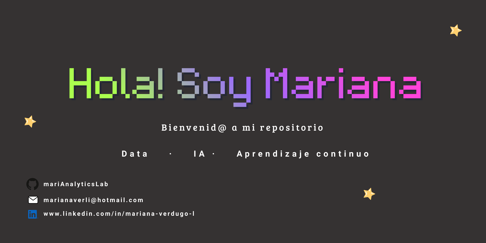

 

  

 

# 👋 ¡Hola, soy Mariana Verdugo!

Soy egresada de la Licenciatura en Analítica de Negocios, con interés en el análisis y la ciencia de datos.  
Este perfil documenta mi proceso de formación continua a través de proyectos prácticos y desarrollo de habilidades técnicas.

## 🔍 Áreas de interés
- Ciencia de datos
- Análisis y visualización de datos
- Minería de datos
- Inteligencia artificial y machine learning
- Programación en Python
- Automatización de procesos

## 👨‍💻 Herramientas y tecnologías principales
- Python
- MySQL
- R (RStudio)
- Jupyter/Google Colab
- VisualStudio Code

## 📂 Proyectos
Cada repositorio incluye:
- Descripción del algoritmo.
- Funcionamiento básico.
- Resultados y aprendizajes obtenidos.
- Herramientas y tecnologías utilizadas.
- Datos, archivos importantes adicionales.
- Limitaciones.
- Disclaimer (en todo caso).

## 📫 Conecta conmigo  
  

